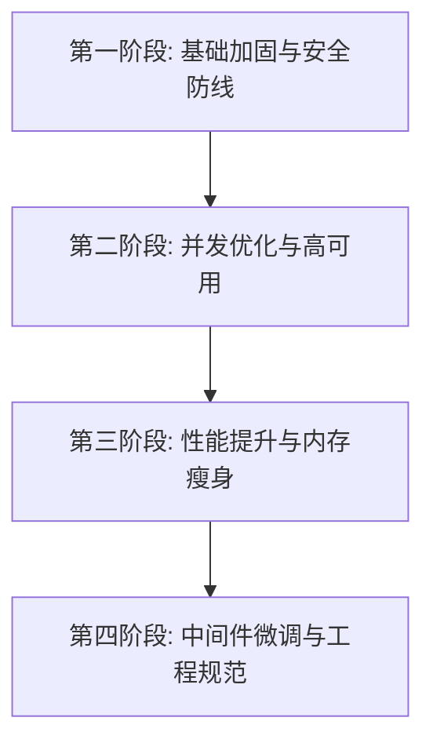

# 问题、待办与演进计划

> 最后更新：2026-07-13。前半部分记录当前问题和状态；“历史方案附录”保留当时的完整决策、实施与验收细节，不把历史计划视为当前完成事实。

---

## 一、已修复（历史全记录）

### 阶段 9（主要修复）

| # | 类别 | 问题 | 修复 |
|---|------|------|------|
| S1 | 安全 | SQL 拼接注入 | `JdbcTemplate` 参数化查询 |
| S2 | 安全 | Admin 路由无前端守卫 | 添加 `requiresAdmin` 守卫 |
| S3 | 安全 | Admin 接口无后端角色校验 | SecurityConfig `.hasRole("ADMIN")` |
| S4 | 安全 | 敏感信息硬编码 | 全部改为 `${ENV_VAR}` + `.env.example` |
| A1 | 架构 | 无全局异常处理 | GlobalExceptionHandler |
| A3 | 架构 | passwordHash 暴露 | 加 `@JsonIgnore` |
| B1 | Bug | 401/403 重定向失效 | axios 拦截器 + router beforeEach |
| B2 | Bug | Tailwind 动态类名不生效 | types.js 存储完整类名 |
| B4 | Bug | SearchBar 回车绕过防抖 | 回车立即搜索 + 图标居中 |

### 咖啡频道增强（2026-06-24）

| # | 类别 | 问题 | 解决 |
|---|------|------|------|
| C1 | 技术 | ECharts 5 tree-shaking 砍掉雷达图 | 改用 `echarts/dist/echarts.esm.js` 完整包（临时方案） |
| C2 | 技术 | v-if 内 ref 绑定延迟，nextTick 拿不到 DOM | 100ms 轮询重试（最多 20 次）等 ref 就绪（临时方案） |
| C3 | 数据 | flavor 字段被风味描述字符串覆盖数值 | 重命名为 flavor_notes，flavor 保持数值 |

### 安全增强（2026-07-02）

| # | 类别 | 问题 | 解决 |
|---|------|------|------|
| SEC1 | 安全 | JWT 密钥使用明文 byte[] | 改为 SHA-256 哈希后使用 |
| SEC2 | 安全 | Admin 默认密码硬编码 `changeme` | 改为 `ADMIN_DEFAULT_PASSWORD` 环境变量 |
| SEC3 | 架构 | Controller 无输入校验 | 新增 LoginRequest/RegisterRequest/ReviewCreateRequest DTO + `@Valid` |

### 功能修复（2026-07-02～07-03）

| # | 类别 | 问题 | 解决 |
|---|------|------|------|
| F4 | 前端 | 空 catch 静默吞错（12 个文件） | 统一改为 `e.response?.data?.error` 提取错误 + ElMessage.error() 展示 |
| B5 | Bug | 后台修改轮播后 Redis 缓存未清除 | AdminController 3 个接口补 `@CacheEvict` |
| B6 | Bug | 游戏 lightbox 键盘导航叠加 | 事件监听器改为稳定引用 |

### 上线冲刺修复（2026-07-04）

| # | 类别 | 问题 | 解决 |
|---|------|------|------|
| BUG-1 | 前端 | AdminDashboard 缺少 TypeIcon，导致崩溃 | 补全 import |
| BUG-2 | 前端 | GameEditorFields fragment 属性穿透警告 | 添加 `inheritAttrs: false` |
| BUG-3 | 前端 | Search/List 网格留空（12 张→20 张→最终 **60** 张，适配 2/3/4/5/6 列全部断点） | 三次迭代修正 |
| BUG-4 | 前端 | Search 翻页时丢失 activeType 过滤条件 | 恢复 `params.type = activeType.value` |
| SEC-4 | 安全 | 密码重置接口明文返回密码 | 改为返回安全提示 message 供弹窗一次性展示 |
| SEC-5 | 安全 | 图片上传无 MIME 类型白名单 | 增加 `getContentType` 强校验 |
| SEC-6 | 安全 | 品类设置缺白名单校验 | 后端硬编码 10 种品类白名单过滤 |
| A2/T6 | 架构 | schema.sql 缺失最新表结构 | 引入 Flyway，合并建立 `V1__Baseline.sql` |
| A4 | 架构 | AdminController 直连 JdbcTemplate | 建立缺失的 Mapper/Entity 并重构调用 |
| A5 | 架构 | AuthController 混入大量业务 | 将 Turnstile 与邀请码逻辑剥离至 AuthService |
| A6 | 架构 | `visibleTypes()` 频繁查库 | 添加 `@Cacheable` 并在修改时 Evict |
| F2 | 前端 | ECharts 全量加载拖慢性能 | 改为动态 import 懒加载 |
| F5 | 前端 | `HelloWorld.vue` 残留 | 彻底删除并清理 gitignore |
| UI-1 | 前端 | 管理后台编辑器控件在 27 寸屏过小 | 移除全局 `size="small"`，恢复 32px 标准高，弹窗加宽 |
| UI-2 | 前端 | 移动端 AppNavbar 菜单排版松散 | 重构为 App 级网格 + 底部独立功能面板 |
| UI-3 | 前端 | 搜索页面标签多时占用大量空间 | 重构为侧边栏结构 + 标签内搜 + 最大高度滚动 |
| BUG-5 | 前端 | 电影/游戏专区 6 列网格末尾留 4 空位（20 不整除 6） | 分页上调至 60（2~6 公倍数） |
| BUG-6 | 前端 | Search.vue 分页编辑时误删 `</script>` 导致编译失败 | 补全闭合标签 |
| BUG-7 | 后端 | 修改 `UserItemService` 后封面不显示 | **必须重启 Spring Boot 进程**，`mvn compile` 不热加载已运行的 JVM |
| OPS-1 | 部署 | `bash async:true` 300s 超时杀死后端 → 用户登录失败 | 改用 `mvn spring-boot:run &` 后台启动 |
| FEAT-1 | 前端 | Profile.vue 简陋纯文字列表 | 重构为 Banner+头像+统计+侧边栏+海报卡片墙 |
| FEAT-2 | 前端 | 4 个文件中散落上千行手写暗黑 CSS | 迁移至 Element Plus 原生 Dark Mode，清理全部 hack |

### 阶段 11（移动端与编辑器深度重构 2026-07-05）

| # | 类别 | 问题 | 解决 |
|---|------|------|------|
| R1 | 架构 | `AdminItemForm` 1500+行，全局状态耦合 | 采用 `v-model` 数据流并动态引入子编辑器，降至两三百行 |
| UI-4 | 前端 | 多个专区 Hero 移动端无滑动交互 | 新增 `touchstart/move/end` 丝滑跟随阻尼动画与防误触 |
| BUG-8 | 前端 | 手机轮播步长写死导致翻页错乱 | `STEP` 改为响应式 `computed` 以匹配移动卡片宽度 |
| UI-5 | 前端 | 桌游专区移动端呈现为极小的 2x2 网格 | 重构为无限横滑画廊 + 动态阴影拼接的原木桌台效果 |
| UI-6 | 前端 | Search页侧边栏将手机首屏挤满 | 侧边栏改为可折叠组件，释放移动端屏效 |
| UI-7 | 前端 | 详情页留白过大，长标题把右侧挤塌 | 移除 85% 强约束与多余 padding，标题添加折行保护，按钮弹性排布 |
| UI-8 | 前端 | 轮播切换时的黑屏闪烁 | 移除 Vue 的 `out-in` Transition，支持底层直接重叠渐变（Crossfade） |
| UI-9 | 前端 | "相关推荐"出现在"评论"上方导致逻辑跳跃 | 交换两组件顺序，底部平滑承接 |

### Spring Boot 4.0 Jackson 3 迁移（2026-07-05）

| # | 类别 | 问题 | 解决 |
|---|------|------|------|
| JACKSON-1 | 后端 | 启动失败：`ResponseAdvice` 找不到 `com.fasterxml.jackson.databind.ObjectMapper` bean | Spring Boot 4.0 默认 JSON 库升级为 Jackson 3，包名从 `com.fasterxml.jackson.*` 改为 `tools.jackson.*`（注解包不变），自动配置只注册 Jackson 3 的 ObjectMapper bean |
| JACKSON-2 | 后端 | `new ObjectMapper()` 编译报错 | Jackson 3 的 ObjectMapper 不可变，必须用 `JsonMapper.builder().build()` 创建 |
| JACKSON-3 | 后端 | `JsonProcessingException` 受检异常不存在 | 改用 `tools.jackson.core.JacksonException`（非受检，继承 RuntimeException） |
| JACKSON-4 | 后端 | `jackson-datatype-jsr310` 依赖冗余 | Jackson 3 已内嵌 Java 时间支持，移除该依赖 |
| JACKSON-5 | 后端 | `RedisConfig` 中 `ObjectMapper.DefaultTyping.NON_FINAL` 编译失败 | Jackson 3 将 `DefaultTyping` 从内部类提升为独立枚举 `tools.jackson.databind.DefaultTyping` |
| JACKSON-6 | 后端 | `GenericJackson2JsonRedisSerializer` 已废弃 | 迁移至 `GenericJacksonJsonRedisSerializer`（Spring Data Redis 4.0 新增，接受 Jackson 3 ObjectMapper） |
| JACKSON-7 | 性能 | `FetchConsumer.autoTag()` 每次 `new ObjectMapper()` | 改为注入 Spring 容器的 ObjectMapper bean |

> **影响范围**：`pom.xml` + 6 个 Java 文件（`ResponseAdvice` / `ItemService` / `IGDBService` / `AdminController` / `FetchConsumer` / `RedisConfig`）
>
> **注意事项**：切换 `GenericJacksonJsonRedisSerializer` 后序列化格式不兼容，需执行 `redis-cli FLUSHDB` 清空旧缓存。Jackson 3 默认行为变化：`FAIL_ON_UNKNOWN_PROPERTIES=false`、`WRITE_DATES_AS_TIMESTAMPS=false`（日期输出 ISO 格式）。

### Java 警告消除（2026-07-09）

> **背景**：IDE（VS Code + JDT Language Server）报告后端 Java 代码共 **127~128 个 WARNING**，涉及 5 大类。经全面排查后分 3 批消除，最终 `mvn compile` 零警告通过。

#### 问题一：未使用导入 / 字段 / 方法（4 个）

| 文件 | 问题 | 原因 | 解决 |
|------|------|------|------|
| `IGDBService.java` | `import java.net.URLEncoder` / `import java.nio.charset.StandardCharsets` 未使用 | 重构后遗留 | 删除 |
| `ItemService.java` | `import java.util.stream.Collectors` 未使用 | 重构后遗留 | 删除 |
| `SteamService.java` | `StringRedisTemplate` 重复导入两次 | 复制粘贴 | 合并为一次 |
| `UserItemService.java` | `import java.util.LinkedHashMap` 未使用 | 重构后遗留 | 删除 |
| `AuthService.java` | `import LambdaUpdateWrapper` 未使用 | 重构后遗留 | 删除 |
| `ItemController.java` | `import JdbcTemplate` / `import Map` 未使用 | 重构后遗留 | 删除 |
| `TMDBService.java` | `jdbcTemplate` 字段及构造函数参数未使用 | 迁移至 MyBatis-Plus 后遗留 | 删除字段+构造函数参数 |
| `DataImportService.java` | `appendJsonRaw()` 方法未使用 / `header` 变量赋值后未使用 | 重构后遗留 | 删除方法+简化为 `reader.readLine()` |

#### 问题二：Unchecked / Raw Type 警告（~40 个）

**原因**：各 Service 使用 `.retrieve().body(Map.class)` 解析外部 API JSON 响应，`Map.class` 是 raw type，后续强转 `(Map<String, Object>)` / `(List<Map<String, Object>>)` 触发 unchecked 警告。

**解决（混合方案）**：

1. **根治**：15 处 `.body(Map.class)` → `.body(new ParameterizedTypeReference<Map<String, Object>>() {})`
   - 涉及：`TMDBService`(4) / `SteamService`(2) / `SteamGridDBService`(2) / `ItunesService`(1) / `BangumiService`(1) / `AuthService`(1) / `AniListService`(1) / `IGDBService`(1) / `AdminController`(2)
   - 各文件添加 `import org.springframework.core.ParameterizedTypeReference;`

2. **局部抑制**：对无法用 ParameterizedTypeReference 解决的嵌套泛型强转（如 `(List<Map<String, Object>>) m.get("results")`），在方法级别添加 `@SuppressWarnings("unchecked")`

3. **清理**：删除 `IGDBService` 中 5 个不再需要的 `@SuppressWarnings("unchecked")`（改用 ParameterizedTypeReference 后强转已消除）

#### 问题三：Null Analysis 警告（~83 个）

**原因**：`.vscode/settings.json` 启用了 `"java.compile.nullAnalysis.mode": "automatic"`，JDT 基于 Spring 的 `@Nullable` 注解进行编译期空值分析。其中 **65 个**是 MyBatis-Plus 的 `LambdaQueryWrapper` / `LambdaUpdateWrapper` 链式调用导致的误报（MyBatis-Plus 的泛型设计让 JDT 无法正确推断非空性）。

**解决**：

1. **9 个类**添加类级 `@SuppressWarnings("null")`，消除 MyBatis-Plus Lambda 误报：
   - `UserItemService` / `AdminController` / `ItemService` / `SteamService` / `TagService` / `AdminService` / `ReviewService` / `DataImportService` / `AuthService`

2. **保留** `nullAnalysis.mode: automatic` 启用（不关闭），维持编译期空值安全提示能力

#### 问题四：Deprecated / Removal 警告（4 个）

| 文件 | 问题 | 原因 | 解决 |
|------|------|------|------|
| `AdminController.java` | `deleteBatchIds()` deprecated | MyBatis-Plus 3.5.4+ 重命名为 `deleteByIds()` | 改为 `deleteByIds(ids)` |
| `RabbitMQConfig.java` | `Jackson2JsonMessageConverter` marked for removal | Spring AMQP 4.0 标记移除 | `@SuppressWarnings("removal")` |
| `ItunesService.java` | `RestClient` 构造方法 deprecated | Spring 7.0 废弃旧构造方法 | `@SuppressWarnings("removal")` |
| `DemoNetApplication.java` | `RedisTemplate.scan(ScanOptions)` deprecated | Spring Data Redis 4.0 废弃 | `@SuppressWarnings("deprecation")` |

> **注**：JDT 对 "marked for removal" 的 API 使用 `removal` 关键字抑制，对普通 deprecated 使用 `deprecation` 关键字。

#### 验证结果

```bash
cd backend && mvn compile -q   # 编译通过，零错误零警告
```

> **影响范围**：18 个 Java 文件
>
> **注意事项**：
> - `ParameterizedTypeReference` 来自 spring-core，无需额外依赖
> - `@SuppressWarnings("null")` 是类级抑制，未来新增方法中的真实空值风险需开发者自行注意
> - MyBatis-Plus 的 `deleteBatchIds` → `deleteByIds` 是 3.5.4+ 的 API 变更，低版本不可用

---

## 二、待修复（已知问题）

### 架构改造进度（对照 [10-代码质量与后端架构审查报告](10-代码质量与后端架构审查报告.md) 的历史详表）

**✅ 已修复（第一阶段）：**

| # | 问题 | 修复方式 |
|---|------|----------|
| 4 | SQL 注入（TagService + ItemService.listHotItems） | `?` 参数化占位符 |
| 5 | 8 个外部 API 无超时 | `RestClientConfig` 统一 5s/15s 超时 |
| 6 | 数据库缺关键索引 | `V2__Add_indexes.sql`（5 个索引） |
| 7 | batchUpdateStatus N+1 查询 | `LambdaUpdateWrapper.in()` 单条批量 SQL |
| 10 | RabbitMQ 无容错 | DLX 死信交换机 + DLQ + prefetch=5 + retry 3 次 |
| 12 | Redis 无连接池 | Lettuce pool（max-active=16） |
| 13 | 文件上传 100MB | 降至 10MB |
| 16 | GenericJackson2JsonRedisSerializer 风险 | Jackson 3 迁移 + `GenericJacksonJsonRedisSerializer` |
| 20 | ObjectMapper 每次 new | Spring 注入全局实例 |
| 22 | reviews 无外键约束 | `V3__Add_foreign_keys.sql`（6 个 FK + ON DELETE CASCADE） |

**🚧 待修复（第二/三/四阶段）：**

| # | 类别 | 问题 | 优先级 | 方案 |
|---|------|------|--------|------|
| 1 | 性能 | 列表接口无分页，全量返回（hot/featured/byType/users/invite-codes/tags） | P1 | MyBatis-Plus `Page<>` 分页 |
| 2 | 性能 | Item 列表返回 description(TEXT) + infoJson(JSON) 大字段 | P1 | `ItemSummaryDTO` 投影 |
| 3 | 性能 | ReviewService.stats() 全量加载评论算平均分 | P1 | SQL 聚合 `COUNT/AVG` |
| 8 | 性能 | Steam 导入串行 HTTP（N+1 外部调用） | P2 | `CompletableFuture` 并行 |
| 9 | 性能 | TMDB 搜索 N+1 外部调用 | P2 | 并行化请求 |
| 11 | 性能 | listHotItems 相关子查询 O(N×M) | P2 | LEFT JOIN + GROUP BY |
| 14 | 架构 | IGDB token 存实例字段（多节点问题） | P2 | Redis 缓存 token |
| 15 | 性能 | SteamGridDB API key 每次查库 | P2 | `@Cacheable` |
| 17 | 安全 | AuthService Turnstile 异常吞没 | P2 | 记录日志 + 明确放行/拒绝 |
| 18 | 性能 | 静态资源 setCachePeriod(0) 禁用缓存 | P3 | 设置 86400（1 天） |
| 19 | 性能 | JWT 每次请求解析 3 次 | P3 | 合并为 1 次返回 Claims |
| 21 | 优化 | 所有缓存统一 10min TTL | P3 | 按缓存名设置不同 TTL |
| 23 | 安全 | AdminController 手动拼接 JSON 字符串 | P3 | `ObjectMapper` 解析/重建 |

### P2 — 架构债务
| # | 类别 | 问题 | 方案 |
|---|------|------|------|
| F3 | 前端 | `auth.js` store `isLoggedIn` 冗余双重判断，`logout()` 用 `window.location.href` 绕过 Router | 清理冗余判断；logout 用 `router.push('/login')` |

### P3 — 体验问题
| # | 问题 | 优先级 | 说明 |
|---|------|--------|------|
| T1 | EPUB 阅读器空白 | P2 | epubjs@0.3 CDN 不稳定，待换 v0.4 或改用 PDF viewer |
| T2 | TMDB 网络不通 | P2 | 中国大陆环境需重试/代理机制 |
| T3 | 游戏轮播卡片文字两行截断（浏览器缩放 125%） | P3 | aspect-[21/10]+overflow-hidden 裁剪，多次尝试未修复 |
| T4 | 管理后台 el-tabs 左边缘被切削 | P3 | Element Plus 内部 nav-scroll 裁剪，暂不处理 |

---

## 三、产品演进计划：体验搭子自适应 Web（已立项，2026-07-13）

### 3.1 产品目标与第一期边界

DemoNet 的下一阶段不是把十个品类做成更大的内容目录，而是成为用户在空闲时间里寻找可靠体验时的“体验搭子”：给出值得做什么、是否马上能做、需要什么条件，以及为什么值得花时间。它服务三类高频情境：

- **独处探索**：在有限时间内发现可立即开始的游戏 Demo、预告片、试读、试听、冲煮或其他低门槛体验；
- **多人相聚**：室友或朋友已经到齐，但尚未决定要玩、看或做什么；
- **两人约会**：依据双方可接受的时间、预算和地点，找到可共同体验的选择。

第一期只交付可分享、可打开的 Web 页面，不把用户带入类似移动 App 的强制问答流。首页仍保持开放浏览；场景、时长、人数和地点只是逐步收窄内容的入口。第一期不做陌生人匹配、投票房间、活动报名交易、实时本地商家抓取或“全品类功能齐平”。

### 3.2 现有能力与缺口

| 已有基础 | 可直接利用 | 当前缺口 |
|---|---|---|
| 首页热门趋势 | `getHotItems()` 按推荐数、人工热度和近 7 天评论计算；横向卡片轨道已有左右翻页、响应式每页卡数与平滑位移 | 热度只说明受关注程度，不能承担“适合某个情境”的策展含义 |
| 首页精选推荐 | `carousel_order` 和后台排序支持运营置顶 | 仅能按品类维护一组顺序，不能表达一个条目属于多个场景、入选理由和场景约束 |
| 内容详情 | 游戏已有试玩与性能测试链接；桌游有规则预览；咖啡有风味和冲煮工具 | 十品类没有统一的“是否能做、要多久、几个人、花多少钱、需要什么条件”契约 |
| 内容与标签 | `items.info_json` 可容纳品类字段，已有标签关联 | 没有独立的场景/策展集合，列表页目前只能按单一品类拉取，无法稳定组成跨品类场景 |

### 3.3 热门趋势卡片交互的复用结论

热门趋势的交互形式应被保留，但不应变成所有页面的默认布局。它适用于“用户想横向探索少量、彼此差异明显的候选项”的场合；不适用于需要比较、筛选或录入数据的场合。

| 位置 | 是否复用横向卡片轨道 | 原因与具体约束 | 优先级 |
|---|---|---|---|
| **热门趋势** | 保留原样 | 继续仅表达近期受关注内容；排序公式和数据来源不改作场景推荐 | P0 |
| **首页场景策展** | 是，首个新增复用点 | 展示“一个人想马上开始”“3–5 人今晚聚”“两人轻松约会”等 3–4 张场景卡；卡片展示人数、时长、地点和一句策展承诺，点击进入独立场景页 | P0 |
| **编辑精选** | 是，保留现有轨道 | 继续是人工置顶的内容集合；文案应解释本期策展主题，不与热门或场景混淆 | P0 |
| **现在可以体验** | 是，但在体验元数据补齐后再增加 | 只展示有真实动作入口的条目，例如试玩、性能测试、预告、试听、试读、规则预览；卡片必须显示动作类型，不把普通商店外链伪装成“立即体验” | P1 |
| **详情页的同场景替代方案** | 是，后续复用 | 例如游戏详情给出“同样适合 3–5 人、90 分钟内”的替代；必须以场景集合关系为准，不能用热门内容冒充相关性 | P2 |
| 品类圆形导航、列表/搜索结果、条件筛选、详情页行动区、后台配置 | 否 | 导航需要总览，结果需要纵向比较和筛选，行动区需要立即理解条件，后台需要高信息密度；这些场合使用网格、筛选器、信息卡或表单更合适 | 不适用 |

首页最多保留三条横向内容轨道：**场景策展、热门趋势、编辑精选**。任一轨道少于两项时不渲染；不叠加自动播放；新轨道使用语义化链接或按钮、键盘可达的左右控制，并在窄屏保留单卡可读性。这样保留已有的探索感，而不会把首页做成多排难以浏览的轮播墙。

### 3.4 数据与内容决策

1. **热门、精选、场景三者分离。** `hot_boost` 只参与热度，`carousel_order` 只服务既有精选/品类 Hero；场景不复用这两个字段。
2. **引入一等的策展集合。** 已通过 Flyway V4 新增 `curation_collections` 与 `curation_collection_items`：集合记录 slug、标题、简介、封面、场景约束、可见性和排序；关联记录内容、顺序、入选理由和编辑备注。一件内容可属于多个集合。公开接口只读取可见集合和已发布内容，且不会返回编辑备注。
3. **在 `info_json` 下增加稳定的 `experience` 命名空间。** 首期字段包括 `actions`（动作、标签、URL、来源、是否官方）、`time_minutes`、`players`、`budget`、`location_mode`、`requirements`、`source_checked_at`。保留现有 `demo_url`、`benchmark_url` 等字段并通过兼容读取逐步迁移，不做一次性重写十个编辑器。
4. **以“可验证的人工策展”取代伪实时承诺。** 首批每个行动链接标出来源与核验日期；咖啡店/线下体验先收录明确的策展条目，不承诺“全城刚开店”或实时营业状态。
5. **先做三组可验证的集合。** 每组至少 4 个已发布条目，至少覆盖一项可实际行动的链接：`一个人，30 分钟内，在线开始`、`3–5 人的宿舍/朋友夜`、`两个人的轻松约会`。数量不足时宁可隐藏该集合，不用低质量条目凑数。

### 3.5 分阶段交付与验收

| 阶段 | 交付 | 通过条件 |
|---|---|---|
| P0-A：定义 | 场景、体验元数据和策展准则的可执行契约；三组种子集合清单 | 每个字段有含义、可选值和数据责任人；每个种子条目有来源、核验日期和入选理由 |
| P0-B：场景闭环 | 场景集合数据、公开接口、后台配置、`/scene/:slug` 页面 | 场景链接可直接分享；页面能说明适合谁、需要什么条件，并展示跨品类的有序候选项 |
| P0-C：首页入口 | 首页新增场景策展轨道，热门趋势与编辑精选保持独立 | 热门的排序和现有左右翻页不回归；首页轨道不超过三条；桌面和 390px 窄屏均可完成打开场景的操作 |
| P0-D：行动信息 | 共用“体验条件卡”，先接入游戏、咖啡和桌游的真实可用字段 | 用户在详情页无需猜测即可知道行动、时长/人数/预算/设备中的已知信息；未知值明确留空，不伪造 |
| P1：可立即体验集合 | 基于完整 `experience.actions` 的“现在可以体验”轨道与筛选 | 只出现有验证动作入口的内容；失效链接可在后台定位和下线 |
| P2：相关场景与轻协作 | 详情页同场景替代、可分享短列表；在需求验证后才评估投票 | 不引入实时房间、陌生人关系或复杂权限；分享页在未登录状态可读 |

详细的任务拆分、依赖、验收与验证命令见 [`tasks/plan.md`](../tasks/plan.md) 和 [`tasks/todo.md`](../tasks/todo.md)。

### 3.6 本轮实现状态（2026-07-13）

- 已完成 P0-1：首批场景 slug、`constraints_json`、`info_json.experience`、旧字段兼容顺序和“即时体验”行动准则已经固定在数据模型文档。`purchase` 与普通 `external` 链接不能冒充试玩、试听或可立即开始的体验。
- 已完成 P0-2a / P0-2b：V4 迁移、集合实体与查询、`GET /api/scenes`、`GET /api/scenes/{slug}` 及公开访问控制均已落地，并通过集合可见性、排序、下线条目过滤和未发布场景 404 的单元测试。
- P0-3a 的管理能力已实现并通过目标测试与前端生产构建：后台可维护草稿、发布状态、场景排序、跨品类条目、入选理由和内部编辑备注；条目替换是事务性的，公开接口不会泄露备注。2026-07-13 正常重启后，匿名访问 `/api/admin/scenes` 被 Spring Security 正确拒绝为 403；已确认后台路由加载。尚待已登录管理员界面的实际录入走查。
- P0-3b 已发布两组集合：`solo-quick-start`（`一个人，30 分钟内，在线开始`）的 4 个关联游戏条目（ID 647、648、650、617）均有独立开发者的 Itch.io 试玩页；`easy-date`（`两个人的轻松约会`）的 4 个电影条目（ID 96、76、75、88）均有用于先选片的 YouTube 预告片入口。2026-07-13 以 HTTP `HEAD` 核验这 8 个动作入口均返回 200。两个集合均记录了来源、核验日期、排序及入选理由；公开列表和详情接口回读为 200，详情各只返回 4 个条目且不包含内部编辑备注。`easy-date` 明确说明完整观影仍依赖用户自行确认流媒体会员、合法片源或影院排期，绝不将预告片写成完整影片播放入口。`friends-night` 的 4 个桌游候选拥有本地规则预览和 BoardGameGeek 来源链接，但其来源页对自动化 `HEAD` 核验统一返回 403；在可用浏览器人工确认或获得替代可验证来源前保持未发布。
- P0-4 的 `/scene/:slug` 页面已实现并通过生产构建：它具有条件说明、条目入选理由、加载骨架、404、失败重试和“未核验内容不展示”的空态。2026-07-13 正常重启后已确认公开列表与首组详情均为 200、非法 limit 为 400、未发布场景为 404；首组的单人、30 分钟和在线条件可从 `constraintsJson` 正常解析。真实浏览器已验证详情页可以从首页打开，4 个候选条目和返回首页链接可访问；390px 宽度下文档宽度为 384px，没有横向溢出，浏览器控制台没有 error。
- P0-5a / P0-5b 的首页场景轨道已接入并通过生产构建：只有至少两个已发布场景时才显示，使用独立的键盘可达左右控制，不改变热门趋势或编辑精选的排序与翻页状态。两个公开场景已满足渲染门槛，真实首页已显示两张场景卡；390px 宽度下卡片仍可访问、文档宽度为 384px、没有横向溢出。P0-5b 的首页接入与响应式验收已完成；P0-5a 的共用轨道外壳提取仍作为代码复用项保留。
- **已修复的录入陷阱**：首次用容器内 MySQL 客户端写入场景内容时，未显式指定客户端字符集，导致新建中文文案显示乱码；已在同一轮内仅重写这两组场景及关联记录，并由真实页面回读确认正常。今后通过命令行导入或维护中文策展数据时，必须使用 `mysql --default-character-set=utf8mb4`（或等价的客户端连接设置）并做页面/API 回读；不得修改既有内容记录来“修复”此类问题。

### 3.7 风险与停止条件

- **内容质量风险**：没有来源、核验日期或行动价值的条目不能进入场景集合；优先扩充已有游戏、电影、动漫、桌游、咖啡和线下数据，不以“十品类齐全”为目标。
- **范围膨胀风险**：第一期只验证“找到并能开始一件事”，不承诺社交撮合、交易、地图和实时数据。
- **信息架构风险**：若场景入口点击率低或用户仍只按品类浏览，保留场景页和直接链接，但不继续扩大场景系统。
- **交互噪声风险**：出现第四条首页横向轨道的需求时，先替换或合并既有轨道；不增加第四条。
- **数据模型风险**：在集合实体和体验元数据接口评审通过前，不修改 `hot_boost`、`carousel_order` 的既有语义，也不把场景选择硬编码到前端。

## 四、既有后续开发计划

| 阶段 | 内容 | 状态 |
|------|------|------|
| 架构改造二 | 外部API并行化 + IGDB Token缓存 + API Key缓存 | 🚧 待开始 |
| 架构改造三 | 列表分页 + DTO瘦身 + Review聚合SQL | 📋 待开始 |
| 架构改造四 | JWT单次解析 + 精细缓存TTL + 静态资源缓存 | 📋 待开始 |
| 12 | **测试建设**：单元/集成测试 + E2E | 📋 待开始 |
| 13 | **功能增强**：Elasticsearch + 定时抓取 + Light Mode | 📋 规划中 |

详细架构改造计划见本文件的[历史方案附录](#历史方案附录)。

---

## 五、中期建议

| # | 建议 | 说明 |
|---|------|------|
| M1 | Redis 缓存 | ✅ 已完成（阶段 8） |
| M2 | 评论系统 | ✅ 已完成（阶段 8） |
| M3 | Swagger 文档 | ✅ 已完成（阶段 8） |
| M4 | 输入校验 | ✅ 已完成（2026-07-02，登录/注册/评论 DTO + @Valid） |
| M5 | 定时抓取 | ⏳ 框架就绪，待接入具体逻辑 |
| M6 | 单元测试 | 📋 当前 0 覆盖（1个存在性验证不算） |

---

## 六、长期建议

| # | 建议 | 说明 |
|---|------|------|
| L1 | Elasticsearch | 替换 `LIKE '%keyword%'` 全表扫描 |
| L2 | CI/CD | GitHub Actions 自动构建部署 |
| L3 | TypeScript 迁移 | 前端类型约束，预防 typo/格式不一致 |
| L4 | 路径别名 | `@/` → `src/`（Vite alias） |
| L5 | 性能监控 | Spring Boot Actuator + Prometheus + Grafana |
| L6 | 响应式双主题 | 全站重构 Tailwind 硬编码色值，引入 CSS 变量以支持一键切换明暗主题 |

---

## 优先级排序

```
安全漏洞 (SEC-4~6) > 已知 Bug (BUG-1~2) > Schema 完整性 > 架构债务 > 测试建设 > 功能增强
```


---

# 历史方案附录

> 本附录原样保留已合并计划的背景、方案、验证和假设。它们描述的是制定当时的决策与执行路径；每项当前完成状态以本文件前文的待办和进度表为准。

## 附录 A：修复与上线计划（原文，2026-07）

# 背景

DemoNet 正在准备上线生产环境。当前代码库在快速迭代过程中积累了技术债务和安全风险（例如控制器中直接使用 JDBC 查询、缺少数据库 schema 迁移、上传缺少 MIME 校验，以及 `Detail.vue` 视图过于臃肿）。目标是在不改变现有产品功能的前提下，加固安全性、统一数据库 schema 管理、清理架构债务，并确保部署配置完全具备生产就绪条件。

# 方案

## 1. 安全加固（独立）
修复文件上传、品类更新和密码重置中的漏洞。
- **MIME 类型校验**：
  - 在 `backend/src/main/java/com/example/demonet/controller/AdminController.java` -> `uploadImage()` 中。
  - 使用 `file.getContentType()` 提取内容类型。
  - 如果内容类型不在允许列表中则拒绝上传：`image/jpeg`、`image/png`、`image/webp`、`image/gif`。对于 `type = "reader"`，额外允许 `application/pdf` 和 `application/epub+zip`。
- **品类类型白名单**：
  - 在 `AdminController.java` -> `updateCategorySettings()` 中。
  - 校验每个 `type` 是否为以下之一：`game`、`movie`、`anime`、`boardgame`、`model`、`book`、`music`、`digital`、`coffee`、`offline`。丢弃无效条目，以防止通过 `REPLACE INTO` 进行 SQL 注入。
- **密码重置隐私**：
  - 在 `AdminController.java` -> `resetPassword()` 中。
  - 不再返回 `Map.of("password", newPassword)`，而是返回 `Map.of("message", "密码已重置为: " + newPassword + " (请将此密码复制发送给用户，窗口关闭后将无法再次查看)")`，使管理后台 UI 明确体现一次性可见性。

## 2. 前端 Bug 修复与优化（独立）
解决控制台警告和打包体积问题。
- **AdminDashboard TypeIcon 修复**：
  - 在 `frontend/src/components/admin/AdminDashboard.vue` 中，于 `<script setup>` 中添加 `import TypeIcon from '../TypeIcon.vue'`，修复组件缺失警告。
- **GameEditorFields Fragment 警告修复**：
  - 在 `frontend/src/components/admin/GameEditorFields.vue` 中，于 `<script setup>` 中添加 `defineOptions({ inheritAttrs: false })`，防止 fragment 根节点上的属性透传警告。
- **ECharts 懒加载**：
  - 在 `frontend/src/views/Detail.vue` 中，移除顶层的 `import * as echarts from "echarts/dist/echarts.esm.js"`。
  - 在 `async function renderRadarChart()` 内部动态导入：`const echarts = await import('echarts/dist/echarts.esm.js');`。这样可以避免 ECharts 在非咖啡详情页上被臃肿加载。
- **清理**：
  - 删除 `frontend/src/components/HelloWorld.vue`。
  - 将 `fix_images.py` 和 `demonet-coffee-plan.md` 追加到 `.gitignore`。

## 3. 数据库 Schema 与 Flyway 迁移（依赖步骤 1）
将碎片化的 schema 定义整合到 Flyway 迁移中，确保环境可复现性。
- **添加 Flyway 依赖**：
  - 在 `backend/pom.xml` 中添加 `flyway-core` 和 `flyway-mysql` 依赖。
- **创建基线迁移**：
  - 将 `backend/src/main/resources/schema.sql` 的内容移动到 `backend/src/main/resources/db/migration/V1__Baseline.sql`。
  - 添加缺失的 `users.enabled` 列：`ALTER TABLE users ADD COLUMN enabled TINYINT DEFAULT 1;`（用安全检查包裹，或者如果假定干净的基线则直接定义在 `CREATE TABLE users` 中）。等等，由于我们是在建立基线，将所有缺失的表（`category_settings`、`invite_codes`、`app_settings`）和列合并到 `V1__Baseline.sql` 中，使用 `CREATE TABLE IF NOT EXISTS` 和正确定义。
- **移除动态 DDL**：
  - 在 `backend/src/main/java/com/example/demonet/service/DataImportService.java` 中，移除任何针对 `invite_codes` 或 `app_settings` 的 `jdbcTemplate.update("CREATE TABLE IF NOT EXISTS ...")` 调用（如果我们查看 DataImportService 的可能结构，或者这些表之前是通过手动 SQL 添加的，则它们应当已经存在）。

## 4. 架构清理（依赖步骤 3）
从控制器中移除直接的 `JdbcTemplate` 使用，强制执行正确的 MVC 分层。
- **创建缺失的实体与 Mapper**：
  - 创建 `AppSetting.java` 和 `AppSettingMapper.java`。
  - 创建 `InviteCode.java` 和 `InviteCodeMapper.java`。
  - 创建 `CategorySetting.java` 和 `CategorySettingMapper.java`。
- **重构 AdminController**：
  - 注入新创建的 Mapper/Service。
  - 将 `getCategorySettings`、`updateCategorySettings`、`listInviteCodes`、`generateInviteCodes`、`getAllSettings`、`updateSetting`、`listUsers`、`toggleBan` 和 `resetPassword` 中的 `jdbcTemplate.queryForList` 和 `jdbcTemplate.update` 替换为 MyBatis-Plus 的 `selectList`、`update`、`insert` 等。
- **重构 AuthController**：
  - 将 `verifyTurnstile` 和 `verifyInviteCode` 方法，连同它们的 `AppSetting` 查询，移动到 `AuthService.register()` 中。`AuthController.register()` 应只处理 Redis 限流，然后调用 `authService.register(req, turnstileToken, inviteCode)`。

## 5. 生产配置
确保生产环境 docker-compose 完全配置就绪。
- **更新 docker-compose.prod.yml**：
  - 在 `backend` 服务下，添加缺失的环境变量以匹配 `application.yml` 和 `.env.example`：
    - `ADMIN_DEFAULT_PASSWORD: ${ADMIN_DEFAULT_PASSWORD:-changeme}`
    - `APP_STEAMGRIDDB_API_KEY: ${STEAMGRIDDB_API_KEY:-}`
    - `SPRING_REDIS_PASSWORD: ${REDIS_PASSWORD:-}`
    - `SPRING_RABBITMQ_USERNAME: ${RABBITMQ_USER:-admin}`

# 关键文件与锚点

- `backend/src/main/java/com/example/demonet/controller/AdminController.java` ：目标为 `uploadImage`、`resetPassword` 以及所有 `jdbcTemplate` 用法。
- `frontend/src/views/Detail.vue` ：目标为 `import * as echarts` 和 `renderRadarChart`。
- `backend/src/main/resources/db/migration/V1__Baseline.sql` ：数据库 schema 的新唯一真相来源。
- `docker-compose.prod.yml` ：目标为 `backend` 服务的 `environment` 块。

# 验证

1. **安全**：通过 Admin 上传 API 上传一个将 `.txt` 改名为 `.png` 的文件。预期返回 `400 Bad Request` 或表示文件类型无效的 `error` map。
2. **前端优化**：在 `frontend` 中运行 `npm run build`。验证 `echarts` 被拆分为独立 chunk，且未包含在主 `index` chunk 中。
3. **数据库迁移**：启动后端并连接到一个全新的 MySQL 数据库。验证 Flyway 自动创建 `flyway_schema_history` 表以及全部 9 张项目表（`items`、`users`、`user_items`、`tags`、`item_tag_mapping`、`reviews`、`category_settings`、`invite_codes`、`app_settings`）。
4. **架构**：以管理员身份登录，在 UI 中导航到"API 设置"和"邀请码"。确保数据加载和保存正常，不出现 `JdbcTemplate` 异常。

# 假设与应急方案

- **Flyway 基线**：假设现有生产数据库（如果有）可以进行基线化（`spring.flyway.baseline-on-migrate=true`）。如果失败，部署者需要在生产数据库上手动执行 `flyway baseline`。我们将在 `application.yml` 中添加 `spring.flyway.baseline-on-migrate: true`。
- **ECharts 动态导入**：假设 Vite 能正确对 ECharts 的动态导入进行 chunk 拆分。如果在运行时解析失败，我们将回退为静态导入，但将其移至专门的包装组件 `CoffeeRadarChart.vue` 以隔离体积膨胀。
- **Turnstile 验证**：假设 Turnstile 密钥验证端点在移动到 `AuthService` 后响应完全一致。移动过程中必须保留降级网络回退逻辑（`log.warn`）。


---

## 附录 B：后端架构改造计划（原文，2026-07）

# 12 - 后端架构改造计划

根据 [10-代码质量与后端架构审查报告](10-代码质量与后端架构审查报告.md) 的历史详表，DemoNet 后端在数据量攀升至千级 items 与万级 reviews 时，在小型服务器上存在较高的崩溃和性能瓶颈风险。为确保线上系统的健壮性、安全性和并发吞吐能力，特制定本期详细改造计划。

---

## 总体改造阶段与排期

改造计划将按照**风险高低与依赖关系**，分阶段迭代进行。



| 阶段 | 核心目标 | 包含项 | 预计改动范围 | 优先级 |
|---|---|---|---|---|
| **第一阶段** | 消除 SQL 注入、无超时挂起、无索引扫表及文件溢出等致命隐患 | 4, 5, 6, 13, 17 | 数据库迁移脚本、配置类、API 请求工具、控制器、安全逻辑 | **P0 (必须修 — 攸关生死)** |
| **第二阶段** | 优化第三方 API 的慢响应阻塞问题，强化 MQ 与缓存的高可用性 | 8, 9, 10, 14, 15 | 外部 API 服务、RabbitMQ 监听器与配置类、Redis 缓存层 | **P1 (应该修 — 防级联故障)** |
| **第三阶段** | 减轻 JVM 内存压力与数据库往返开销，消灭 N+1 查询与大字段传输 | 1, 2, 3, 7, 11, 23 | Controller 分页设计、查询 DTO 投影、MyBatis-Plus 查询及批量更新、JSON 序列化 | **P1 (应该修 — 提升响应性能)** |
| **第四阶段** | 深度优化认证流程、网络层缓存、对象复用，增强项目代码健壮性 | 12, 16, 18, 19, 20, 21, 22 | Spring Security 过滤器、Redis 序列化器、静态资源路径配置、实体外键与映射 | **P2 (优化项 — 锦上添花)** |

---

## 第一阶段：基础加固与安全防线

### 4. 修复 SQL 注入漏洞（2处）
* **改造位置**：
  1. `TagService.java` -> [getItemIdsByTagNames()](file:///C:/Users/Victor/Documents/CodeBase/DemoNet/backend/src/main/java/com/example/demonet/service/TagService.java#L88)
  2. `ItemService.java` -> [listHotItems()](file:///C:/Users/Victor/Documents/CodeBase/DemoNet/backend/src/main/java/com/example/demonet/service/ItemService.java#L155)
* **改造细节**：
  - **TagService 修复前**：直接拼接单引号转义后的字符串为 SQL。
  - **TagService 修复后**：利用 JDBC `?` 参数化绑定占位符动态构建，代码示例如下：
    ```java
    public List<Long> getItemIdsByTagNames(List<String> tagNames) {
        if (tagNames == null || tagNames.isEmpty()) return List.of();
        String placeholders = String.join(",", tagNames.stream().map(s -> "?").toList());
        String sql = "SELECT DISTINCT itm.item_id FROM item_tag_mapping itm " +
                     "JOIN tags t ON t.id = itm.tag_id WHERE t.name IN (" + placeholders + ")";
        return jdbcTemplate.queryForList(sql, Long.class, tagNames.toArray());
    }
    ```
  - **ItemService 修复前**：`sql += " AND i.type = '" + type.replace("'", "''") + "'";` 易产生盲注隐患。
  - **ItemService 修复后**：将 `listHotItems` 替换为标准的参数化查询，或改用 MyBatis-Plus 自带的持久化方案进行封装。

### 5. 外部 API 统一配置超时机制
* **改造位置**：
  - `backend/src/main/java/com/example/demonet/config/` 新建 [RestClientConfig.java](file:///C:/Users/Victor/Documents/CodeBase/DemoNet/backend/src/main/java/com/example/demonet/config/RestClientConfig.java)
  - 重构所有外部 API Service（`SteamService`、`TMDBService`、`IGDBService`、`AniListService`等，改用注入的 RestClient）。
* **改造细节**：
  - 弃用所有的 `RestClient.create()` 类静态初始化。
  - 声明全局通用的 `RestClient` Bean，显式设置超时参数：
    - 连接超时（`connectTimeout`）：`5000ms`（5秒）
    - 读取超时（`readTimeout`）：`15000ms`（15秒）
    - 使用 `SimpleClientHttpRequestFactory`（或生产环境建议的 `JdkClientHttpRequestFactory`）。
    ```java
    @Bean
    public RestClient restClient() {
        SimpleClientHttpRequestFactory factory = new SimpleClientHttpRequestFactory();
        factory.setConnectTimeout(5000);
        factory.setReadTimeout(15000);
        return RestClient.builder().requestFactory(factory).build();
    }
    ```

### 6. 数据库缺失关键索引补全
* **改造位置**：
  - 新建数据库迁移脚本 `backend/src/main/resources/db/migration/V2__Add_indexes.sql`。
* **改造细节**：
  - **reviews 表**：为外键字段 `item_id`、`user_id` 添加索引，极大加速按商品和用户检索评价的效率。
  - **user_items 表**：为 `(user_id, item_id)` 组合字段创建**唯一索引** `idx_user_item`，防范高并发下的重复数据。
  - **items 表**：为 `status` 添加索引，显著优化 `WHERE status = 1` 的前台首页查询。
  - **item_tag_mapping 表**：为 `tag_id` 添加索引，加快删除标签时的级联清理效率。
  - *SQL 脚本内容*：
    ```sql
    CREATE INDEX idx_reviews_item ON reviews (item_id);
    CREATE INDEX idx_reviews_user ON reviews (user_id);
    CREATE UNIQUE INDEX idx_user_item ON user_items (user_id, item_id);
    CREATE INDEX idx_items_status ON items (status);
    CREATE INDEX idx_itm_tag ON item_tag_mapping (tag_id);
    ```

### 13. 文件上传安全性与大文件溢出限制
* **改造位置**：
  - [application.yml](file:///C:/Users/Victor/Documents/CodeBase/DemoNet/backend/src/main/resources/application.yml)
* **改造细节**：
  - 将配置文件中的多媒体传输上限从 `100MB` 下调到 `10MB`（限制恶意大文件耗尽网络带宽和磁盘）：
    ```yaml
    spring:
      servlet:
        multipart:
          max-file-size: 10MB
          max-request-size: 10MB
    ```

### 17. 验证码（Turnstile）验证异常加固
* **改造位置**：
  - [AuthService.java](file:///C:/Users/Victor/Documents/CodeBase/DemoNet/backend/src/main/java/com/example/demonet/service/AuthService.java)
* **改造细节**：
  - 拦截并捕获 Turnstile 请求可能抛出的 `RestClientException`，不再空吞异常。
  - 在验证失败或异常抛出时，打印日志并明确返回 `400 / 503` 拒绝用户注册，确保验证机制不形同虚设。

---

## 第二阶段：并发优化与高可用

### 8 & 9. 第三方数据抓取（Steam/TMDB）N+1 并行化与性能改造
* **改造位置**：
  - [SteamService.java](file:///C:/Users/Victor/Documents/CodeBase/DemoNet/backend/src/main/java/com/example/demonet/service/SteamService.java)
  - [TMDBService.java](file:///C:/Users/Victor/Documents/CodeBase/DemoNet/backend/src/main/java/com/example/demonet/service/TMDBService.java)
* **改造细节**：
  - **DLC / 封面 HTTP 请求并行化**：利用 `CompletableFuture` 将串行 HTTP（如 `resolvePosterUrl` 对 4 个 CDN 域名的 HEAD 请求，`extractDLC` 循环内对 5 个 DLC 的明细查询）改为并行请求。
    ```java
    List<CompletableFuture<DlcDto>> futures = ids.stream()
        .map(id -> CompletableFuture.supplyAsync(() -> fetchDlcDetail(id), dlcExecutor))
        .toList();
    CompletableFuture.allOf(futures.toArray(new CompletableFuture[0])).join();
    ```
  - **配置独立线程池**：自定义线程池限制 Steam 的请求并发，核心线程数 4-6，防止由于对目标服务器瞬间触发大量请求而导致系统 IP 遭到限制封锁。

### 10. RabbitMQ 容错与高可用保障
* **改造位置**：
  - [RabbitMQConfig.java](file:///C:/Users/Victor/Documents/CodeBase/DemoNet/backend/src/main/java/com/example/demonet/config/RabbitMQConfig.java)
  - [FetchConsumer.java](file:///C:/Users/Victor/Documents/CodeBase/DemoNet/backend/src/main/java/com/example/demonet/service/FetchConsumer.java)
  - [application.yml](file:///C:/Users/Victor/Documents/CodeBase/DemoNet/backend/src/main/resources/application.yml)
* **改造细节**：
  - **流量整形（Prefetch）**：配置消费者 `prefetch = 5`，即消费者一次仅缓存 5 条消息，处理完毕才拉取下一批，避免高并发下消费者内存耗尽。
  - **死信队列（DLQ）**：配置死信交换机（`FetchDLX`）和死信队列（`FetchDLQ`），遇到不可恢复的解析异常，或是重试 3 次均失败的消息直接投递至 DLQ，防止消费进程死循环挂起。
    ```yaml
    spring:
      rabbitmq:
        listener:
          simple:
            acknowledge-mode: manual
            prefetch: 5
            retry:
              enabled: true
              max-attempts: 3
    ```

### 14. IGDB Token 全局缓存化
* **改造位置**：
  - [IGDBService.java](file:///C:/Users/Victor/Documents/CodeBase/DemoNet/backend/src/main/java/com/example/demonet/service/IGDBService.java)
* **改造细节**：
  - 弃用类成员变量 `accessToken`。使用 Redis 统一存储 Token，以 `igdb:token` 为 Key，将过期时间设为官方返回的 `expires_in - 60` 秒，解决多节点集群部署时各自高并发同步锁（`synchronized`）争用。

### 15. 第三方 API Key 缓存化
* **改造位置**：
  - [SteamGridDBService.java](file:///C:/Users/Victor/Documents/CodeBase/DemoNet/backend/src/main/java/com/example/demonet/service/SteamGridDBService.java) -> `getApiKey()`
* **改造细节**：
  - 对调用数据库获取 API 密钥的方法使用缓存修饰，免去高频拉取海报时重复对 `app_settings` 表进行 SQL SELECT 查询：
    ```java
    @Cacheable(value = "appSettings", key = "'steamgriddb_api_key'")
    public String getApiKey() { ... }
    ```
  - 当管理员在后台修改该配置时，使用 `@CacheEvict(value = "appSettings", allEntries = true)` 强行失效相关缓存。

---

## 第三阶段：性能提升与内存瘦身

### 1. 列表接口全面支持物理分页
* **改造位置**：
  - [ItemController.java](file:///C:/Users/Victor/Documents/CodeBase/DemoNet/backend/src/main/java/com/example/demonet/controller/ItemController.java) (`listByType`)
  - [UserItemController.java](file:///C:/Users/Victor/Documents/CodeBase/DemoNet/backend/src/main/java/com/example/demonet/controller/UserItemController.java) (`listByUser`)
  - [AdminController.java](file:///C:/Users/Victor/Documents/CodeBase/DemoNet/backend/src/main/java/com/example/demonet/controller/AdminController.java) (`listUsers`, `listInviteCodes`)
* **改造细节**：
  - 对上述 API 的 RequestMapping 方法进行重载重写，增加 `@RequestParam(defaultValue = "1") int page` 与 `@RequestParam(defaultValue = "20") int size`。
  - 使用 MyBatis-Plus 的 `Page` 机制在底层自动生成物理分页 SQL（`LIMIT ? OFFSET ?`）。限制 `size` 上限为 `100` 以免爆内存。
  - **以 AdminController.java 为例**：
    - 针对 `users` 查询，修改 Mapper 接口传参：
      ```java
      @Select("SELECT id, username, email, role, enabled, created_at FROM users ORDER BY created_at DESC")
      IPage<Map<String, Object>> selectUserList(Page<?> page);
      ```
    - 针对 `invite-codes` 查询，修改 Mapper 接口传参：
      ```java
      @Select("SELECT ic.*, u.username as used_by_name FROM invite_codes ic LEFT JOIN users u ON ic.used_by = u.id ORDER BY ic.created_at DESC")
      IPage<Map<String, Object>> selectWithUsers(Page<?> page);
      ```

### 2. Item 列表数据传输瘦身与 DTO 投影
* **改造位置**：
  - 新建 `com.example.demonet.dto.ItemSummaryDTO.java`
  - 重构所有返回商品列表的 Service 方法。
* **改造细节**：
  - 前端渲染卡片或列表时，仅需要商品的基础结构，但当前接口全量查询了包含大文本的 `description` 与包含大 JSON 树的 `info_json` 字段。
  - **改造设计**：
    - 查询时在 Mapper 中仅 select 摘要字段：
      ```java
      LambdaQueryWrapper<Item> query = new LambdaQueryWrapper<>();
      query.select(Item::getId, Item::getType, Item::getTitle, Item::getSlug, Item::getCoverUrl, Item::getPosterUrl, Item::getStatus);
      ```
    - 映射为 `ItemSummaryDTO`，大幅压缩网卡 I/O 带宽。

### 3. Review 统计 SQL 聚合优化
* **改造位置**：
  - [ReviewMapper.java](file:///C:/Users/Victor/Documents/CodeBase/DemoNet/backend/src/main/java/com/example/demonet/mapper/ReviewMapper.java)
  - [ReviewService.java](file:///C:/Users/Victor/Documents/CodeBase/DemoNet/backend/src/main/java/com/example/demonet/service/ReviewService.java) -> [stats()](file:///C:/Users/Victor/Documents/CodeBase/DemoNet/backend/src/main/java/com/example/demonet/service/ReviewService.java#L37)
* **改造细节**：
  - **弃用原有设计**：先 `selectList` 查出所有的 Review 对象进入 JVM，再通过 Stream 过滤和计算。
  - **改进为聚合 SQL**：
    - 在 Mapper 接口声明聚合查询：
      ```java
      @Select("SELECT COUNT(*) as count, IFNULL(AVG(rating), 0) as avgRating FROM reviews WHERE item_id = #{itemId}")
      Map<String, Object> selectStats(@Param("itemId") Long itemId);
      ```
    - 在 `stats()` 中直接获取 Map 结果值并格式化返回，无需将整条评论文本加载到内存。

### 7. 批量状态更新消除 N+1 查询
* **改造位置**：
  - [AdminService.java](file:///C:/Users/Victor/Documents/CodeBase/DemoNet/backend/src/main/java/com/example/demonet/service/AdminService.java) -> [batchUpdateStatus()](file:///C:/Users/Victor/Documents/CodeBase/DemoNet/backend/src/main/java/com/example/demonet/service/AdminService.java#L103)
* **改造细节**：
  - **改造前**：循环内执行 `selectById` 再执行 `updateById`，高并发批量操作时严重阻塞连接池。
  - **改造后**：使用单条批量 SQL 替代。
    ```java
    public int batchUpdateStatus(List<Long> ids, Integer status) {
        if (ids == null || ids.isEmpty()) return 0;
        LambdaUpdateWrapper<Item> wrapper = new LambdaUpdateWrapper<>();
        wrapper.in(Item::getId, ids).set(Item::getStatus, status);
        return itemMapper.update(null, wrapper);
    }
    ```

### 11 & 23. 热门度计算与元数据拼接安全
* **改造位置**：
  - `ItemService.java` -> `listHotItems()`
  - `AdminController.java` -> `uploadImage` (关于 reader_url 拼接)
* **改造细节**：
  - **热门度查询**：`listHotItems` 中结合补充后的 `reviews.item_id` 索引，通过 LEFT JOIN & GROUP BY 对 7 天内评价数进行聚合查询，移除极其低效的相关子查询。
  - **元数据拼接安全**：废弃正则对 `info_json` 文本的纯字符串拼接逻辑。在 `AdminController` 中引入全局 `ObjectMapper` 读取已有树，然后追加节点信息：
    ```java
    JsonNode node = objectMapper.readTree(existingJson);
    ((ObjectNode) node).put("reader_url", url);
    item.setInfoJson(objectMapper.writeValueAsString(node));
    ```

---

## 第四阶段：中间件加固与工程规范

### 12. Redis 连接池引入与加固
* **改造位置**：
  - `application.yml`
* **改造细节**：
  - 显式引入 Lettuce 的连接池配置，在高频存取操作中无需串行排队：
    ```yaml
    spring:
      redis:
        lettuce:
          pool:
            max-active: 16
            max-idle: 8
            min-idle: 2
            max-wait: 2000ms
    ```

### 16. 杜绝 Redis 序列化安全隐患
* **改造位置**：
  - [RedisConfig.java](file:///C:/Users/Victor/Documents/CodeBase/DemoNet/backend/src/main/java/com/example/demonet/config/RedisConfig.java)
* **改造细节**：
  - 废弃 `GenericJackson2JsonRedisSerializer`，它在序列化时写入的 `@class` 类包信息存在著名的反序列化 RCE 风险。
  - **改进方案**：改用以实体类型限定泛型的 `Jackson2JsonRedisSerializer`，或者在 `ObjectMapper` 的 `DefaultTyping` 配置中设置受信任的白名单包前缀（如 `com.example.demonet.*`）。

### 18. 静态资源开启强缓存
* **改造位置**：
  - [WebConfig.java](file:///C:/Users/Victor/Documents/CodeBase/DemoNet/backend/src/main/java/com/example/demonet/config/WebConfig.java)
* **改造细节**：
  - 修正当前静态资源配置中直接设定 `setCachePeriod(0)` 导致重复从服务器拉取资源的性能损失：
    ```java
    registry.addResourceHandler("/uploads/**")
            .addResourceLocations("file:" + uploadDir + "/")
            .setCachePeriod(86400); // 开启浏览器 24 小时本地强缓存
    ```

### 19. JWT 认证性能调优
* **改造位置**：
  - [JwtAuthFilter.java](file:///C:/Users/Victor/Documents/CodeBase/DemoNet/backend/src/main/java/com/example/demonet/security/JwtAuthFilter.java)
  - [JwtTokenProvider.java](file:///C:/Users/Victor/Documents/CodeBase/DemoNet/backend/src/main/java/com/example/demonet/security/JwtTokenProvider.java)
* **改造细节**：
  - 将原有的 `validateToken`、`getUserIdFromToken`、`getRoleFromToken` 三次解析校验合并为 1 次。
  - 在 `JwtTokenProvider` 中实现 `parseToken(token)` 方法直接返回 `Claims` 对象，随后在 Filter 流程中统一利用该 Claims 获取各项字段，免除 HMAC 多次验证计算。

### 20. 共享 ObjectMapper 实例
* **改造位置**：
  - `ItemService.java` -> `mergeInfoJson()` 中频繁的 `new ObjectMapper()`。
* **改造细节**：
  - 提取为 `private final ObjectMapper objectMapper;` 并通过构造函数由 Spring 统一注入，实现单例重用，降低 GC 负荷。

### 21. 精细化缓存 TTL
* **改造位置**：
  - `RedisConfig.java`
* **改造细节**：
  - 通过 `RedisCacheManager` 为不同缓存 Key 指定不同的 Survival Time，比如对 `visibleTypes` 设置 2 小时 TTL，`hotItems` 设置 5 分钟 TTL。

### 22. reviews 表物理级联删除
* **改造位置**：
  - `V2__Add_indexes.sql`
* **改造细节**：
  - 补全 reviews 表的 `FOREIGN KEY` 绑定到 `items` 与 `users` 表上，且设定 `ON DELETE CASCADE`，保证在管理员删除商品或用户注销时数据库的完整性，不产生数据孤儿。

---

## 改造验证方案

| 序号 | 测试优化项 | 验证手段 | 预期结果 |
|---|---|---|---|
| 1 | SQL 注入防御 | 尝试在热门和标签筛选接口发送恶意单引号与注入攻击载荷 | 系统应正常处理为空或抛出可控异常，**绝对不应**执行注入 SQL 代码 |
| 2 | 超时熔断 | 模拟内部调用的第三方服务（例如 iTunes 或 Steam 接口）处于无响应/极慢状态 | 超过 15 秒后当前线程应能自动触发超时中断抛出 `SocketTimeoutException`，Tomcat 不得崩溃 |
| 3 | 缓存与 N+1 | 批量拉取 10 个以上游戏的 Steam 海报及明细，观察 SQL 与 HTTP 日志 | 数据库端无重复查询 `app_settings`；网络端呈并行拉取特征且速度成倍增加 |
| 4 | 列表分页及瘦身 | 携带 `page=1&size=5` 请求 types 列表接口，抓包查看 JSON 报文体积 | JSON 返回对象成功分页，且不包含 `description` 及 `info_json` 字段，响应报文小于 5KB |
| 5 | 高并发安全 | 编写单用户对同一 item 的 100 次高并发收藏请求压测脚本 | 数据库因唯一索引拒绝多余写入，数据表中**只有唯一的一条**收藏映射 |
| 6 | JWT 性能 | 并发模拟 500 个带 Token 的请求 | JWT 验证逻辑中没有重复的 HMAC 密码学运算，处理响应稳定 |


---

## 附录 C：规范化重构计划（原文，2026-07）

# 13 - 第五阶段规范化重构计划（重塑前后端契约）

> 计划日期：2026-07-05
> 目标：解决 DemoNet 目前在接口契约、输入校验、代码规范方面不够专业的问题，达到工业级生产环境代码标准。

---

## 一、 当前系统存在的“不专业”痛点

经过前四个阶段的优化，系统虽然在性能和安全性上得到了保障，但在业务代码编写规范上仍存在以下初级写法（Code Smells）：

### 1. 后端响应契约缺失 (Response Format)
- **现象**：Controller 返回值五花八门，有 `List<Item>`，有 `Map<String, Object>`，有 `ResponseEntity<Map>`。
- **危害**：前端缺乏统一格式（如 HTTP 200 下的 `code !== 200` 业务报错）进行全局拦截，API 结构极度不规范，对接成本高。

### 2. DTO 与 JSR-303 数据校验缺失 (Validation)
- **现象**：`AdminController` 大量直接使用 `@RequestBody Map<String, Object>` 接收数据。
- **危害**：完全放弃了 Spring 强大的 Bean Validation（`@NotBlank` 等），任由可能非法的脏数据进入业务层甚至引发 NullPointerException。此外，实体类直接暴露至外层，泄露底层 ORM 设计。

### 3. 全局异常缺少排查上下文 (Exception Context)
- **现象**：报错仅仅是 `log.error("Server error", e)`。
- **危害**：线上发生错误时，无法溯源是哪个用户、访问哪个 URL 触发的，排查无从下手。

### 4. 前端 SPA 跳转被破坏 (Frontend Router)
- **现象**：Token 过期时使用 `window.location.href = '/login'`。
- **危害**：触发浏览器全局暴力刷新，导致 Vue 单页应用特性失效，Pinia 内存状态丢失，无法实现登录后回跳拦截前的页面。

### 5. 前端 API 错误处理零散 (Frontend Interceptor)
- **现象**：axios 只拦截了 401/403，普通的 400/500 报错或者业务级错误只能在每个业务组件的 `catch` 中单独手写弹窗提示。
- **危害**：产生大量重复的 `ElMessage.error()` 冗余代码。

---

## 二、 第五阶段重构执行计划

为解决上述痛点，我们将按以下步骤分块实施重构：

### 📌 步骤 1：构建全局响应外壳 (ApiResponse) 与全局异常增强
- **后端**：
  - 创建通用的 `ApiResponse<T>` / `Result<T>` 类（包含 `code`, `message`, `data`, `timestamp`）。
  - 创建 `@RestControllerAdvice` 配合 `ResponseBodyAdvice`，无侵入式拦截所有 Controller 并自动包装为 `ApiResponse`（对原本就返回 ResponseEntity 的部分进行兼容处理）。
  - 在 `GlobalExceptionHandler` 中引入 HttpServletRequest，在异常日志中补齐请求 URL 等上下文信息，并统一输出 `ApiResponse` 格式错误。

### 📌 步骤 2：强类型 DTO 改造与 @Valid 参数校验
- **后端**：
  - 针对 `AdminController` 中的增删改查创建相应的 `XxxRequest` DTO（如 `ItemStatusUpdateReq`, `SettingUpdateReq` 等）。
  - 在 Controller 参数前添加 `@Valid` 与 `@RequestBody`，消灭所有的 `Map<String, Object>` 传参。
  - 补充 `MethodArgumentNotValidException` 在全局异常中的统一拦截返回格式。

### 📌 步骤 3：前端 axios 拦截器与 Vue Router 修复
- **前端**：
  - 在 `src/api/request.js` 引入 Vue Router 实例，将 `window.location.href` 替换为 `router.push({ name: 'Login', query: { redirect: ... } })`。
  - 在响应拦截器（Response Interceptor）中，适配后端全新的 `ApiResponse` 结构，如果业务 `code` 不等于成功码，统一在此处唤起 `ElMessage.error`，业务组件不再需要显式 catch 弹窗。

### 📌 步骤 4：前后端联调测试
- 针对前端管理后台以及公共页面的接口调用进行全面回归测试。
- 更新 `document/07-部署运维.md` 的验收测试用例附录，追加关于 DTO 校验、统一报错格式以及无刷新跳转的第五阶段验收用例。
