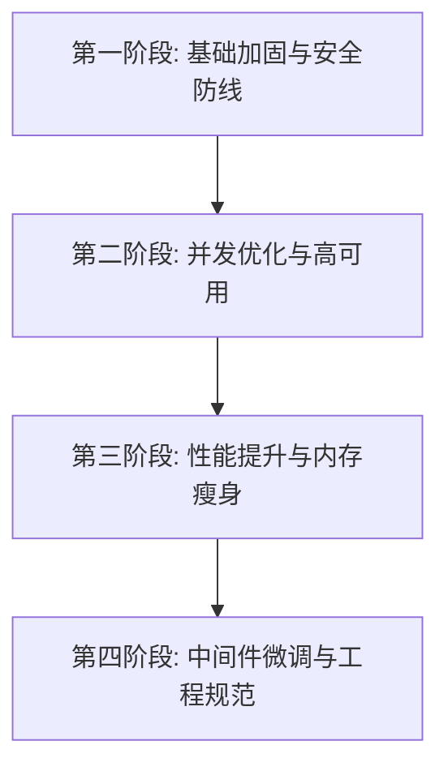

# 12 - 后端架构改造计划

根据对 [11 - 后端架构分析](file:///C:/Users/Victor/Documents/CodeBase/DemoNet/document/11-%E5%90%8E%E7%AB%AF%E6%9E%B6%E6%9E%84%E5%88%86%E6%9E%90.md) 报告的评估，DemoNet 后端在数据量攀升至千级 items 与万级 reviews 时，在小型服务器上存在极高的崩溃和性能瓶颈隐患。为了确保线上系统的健壮性、安全性和高并发吞吐能力，特制定本期周密详细的改造计划。

---

## 总体改造阶段与排期

改造计划将按照**风险高低与依赖关系**，分阶段迭代进行。



| 阶段 | 核心目标 | 包含项 | 预计改动范围 | 优先级 |
|---|---|---|---|---|
| **第一阶段** | 消除 SQL 注入、无超时挂起、无索引扫表及文件溢出等致命隐患 | 4, 5, 6, 13, 17 | 数据库迁移脚本、配置类、API 请求工具、控制器、安全逻辑 | **P0 (必须修 — 攸关生死)** |
| **第二阶段** | 优化第三方 API 的慢响应阻塞问题，强化 MQ 与缓存的高可用性 | 8, 9, 10, 14, 15 | 外部 API 服务、RabbitMQ 监听器与配置类、Redis 缓存层 | **P1 (应该修 — 防级联故障)** |
| **第三阶段** | 减轻 JVM 内存压力与数据库往返开销，消灭 N+1 查询与大字段传输 | 1, 2, 3, 7, 11, 23 | Controller 分页设计、查询 DTO 投影、MyBatis-Plus 查询及批量更新、JSON 序列化 | **P1 (应该修 — 提升响应性能)** |
| **第四阶段** | 深度优化认证流程、网络层缓存、对象复用，增强项目代码健壮性 | 12, 16, 18, 19, 20, 21, 22 | Spring Security 过滤器、Redis 序列化器、静态资源路径配置、实体外键与映射 | **P2 (优化项 — 锦上添花)** |

---

## 第一阶段：基础加固与安全防线

### 4. 修复 SQL 注入漏洞（2处）
* **改造位置**：
  1. `TagService.java` -> [getItemIdsByTagNames()](file:///C:/Users/Victor/Documents/CodeBase/DemoNet/backend/src/main/java/com/example/demonet/service/TagService.java#L88)
  2. `ItemService.java` -> [listHotItems()](file:///C:/Users/Victor/Documents/CodeBase/DemoNet/backend/src/main/java/com/example/demonet/service/ItemService.java#L155)
* **改造细节**：
  - **TagService 修复前**：直接拼接单引号转义后的字符串为 SQL。
  - **TagService 修复后**：利用 JDBC `?` 参数化绑定占位符动态构建，代码示例如下：
    ```java
    public List<Long> getItemIdsByTagNames(List<String> tagNames) {
        if (tagNames == null || tagNames.isEmpty()) return List.of();
        String placeholders = String.join(",", tagNames.stream().map(s -> "?").toList());
        String sql = "SELECT DISTINCT itm.item_id FROM item_tag_mapping itm " +
                     "JOIN tags t ON t.id = itm.tag_id WHERE t.name IN (" + placeholders + ")";
        return jdbcTemplate.queryForList(sql, Long.class, tagNames.toArray());
    }
    ```
  - **ItemService 修复前**：`sql += " AND i.type = '" + type.replace("'", "''") + "'";` 易产生盲注隐患。
  - **ItemService 修复后**：将 `listHotItems` 替换为标准的参数化查询，或改用 MyBatis-Plus 自带的持久化方案进行封装。

### 5. 外部 API 统一配置超时机制
* **改造位置**：
  - `backend/src/main/java/com/example/demonet/config/` 新建 [RestClientConfig.java](file:///C:/Users/Victor/Documents/CodeBase/DemoNet/backend/src/main/java/com/example/demonet/config/RestClientConfig.java)
  - 重构所有外部 API Service（`SteamService`、`TMDBService`、`IGDBService`、`AniListService`等，改用注入的 RestClient）。
* **改造细节**：
  - 弃用所有的 `RestClient.create()` 类静态初始化。
  - 声明全局通用的 `RestClient` Bean，显式设置超时参数：
    - 连接超时（`connectTimeout`）：`5000ms`（5秒）
    - 读取超时（`readTimeout`）：`15000ms`（15秒）
    - 使用 `SimpleClientHttpRequestFactory`（或生产环境建议的 `JdkClientHttpRequestFactory`）。
    ```java
    @Bean
    public RestClient restClient() {
        SimpleClientHttpRequestFactory factory = new SimpleClientHttpRequestFactory();
        factory.setConnectTimeout(5000);
        factory.setReadTimeout(15000);
        return RestClient.builder().requestFactory(factory).build();
    }
    ```

### 6. 数据库缺失关键索引补全
* **改造位置**：
  - 新建数据库迁移脚本 `backend/src/main/resources/db/migration/V2__Add_indexes.sql`。
* **改造细节**：
  - **reviews 表**：为外键字段 `item_id`、`user_id` 添加索引，极大加速按商品和用户检索评价的效率。
  - **user_items 表**：为 `(user_id, item_id)` 组合字段创建**唯一索引** `idx_user_item`，防范高并发下的重复数据。
  - **items 表**：为 `status` 添加索引，显著优化 `WHERE status = 1` 的前台首页查询。
  - **item_tag_mapping 表**：为 `tag_id` 添加索引，加快删除标签时的级联清理效率。
  - *SQL 脚本内容*：
    ```sql
    CREATE INDEX idx_reviews_item ON reviews (item_id);
    CREATE INDEX idx_reviews_user ON reviews (user_id);
    CREATE UNIQUE INDEX idx_user_item ON user_items (user_id, item_id);
    CREATE INDEX idx_items_status ON items (status);
    CREATE INDEX idx_itm_tag ON item_tag_mapping (tag_id);
    ```

### 13. 文件上传安全性与大文件溢出限制
* **改造位置**：
  - [application.yml](file:///C:/Users/Victor/Documents/CodeBase/DemoNet/backend/src/main/resources/application.yml)
* **改造细节**：
  - 将配置文件中的多媒体传输上限从 `100MB` 下调到 `10MB`（限制恶意大文件耗尽网络带宽和磁盘）：
    ```yaml
    spring:
      servlet:
        multipart:
          max-file-size: 10MB
          max-request-size: 10MB
    ```

### 17. 验证码（Turnstile）验证异常加固
* **改造位置**：
  - [AuthService.java](file:///C:/Users/Victor/Documents/CodeBase/DemoNet/backend/src/main/java/com/example/demonet/service/AuthService.java)
* **改造细节**：
  - 拦截并捕获 Turnstile 请求可能抛出的 `RestClientException`，不再空吞异常。
  - 在验证失败或异常抛出时，打印日志并明确返回 `400 / 503` 拒绝用户注册，确保验证机制不形同虚设。

---

## 第二阶段：并发优化与高可用

### 8 & 9. 第三方数据抓取（Steam/TMDB）N+1 并行化与性能改造
* **改造位置**：
  - [SteamService.java](file:///C:/Users/Victor/Documents/CodeBase/DemoNet/backend/src/main/java/com/example/demonet/service/SteamService.java)
  - [TMDBService.java](file:///C:/Users/Victor/Documents/CodeBase/DemoNet/backend/src/main/java/com/example/demonet/service/TMDBService.java)
* **改造细节**：
  - **DLC / 封面 HTTP 请求并行化**：利用 `CompletableFuture` 将串行 HTTP（如 `resolvePosterUrl` 对 4 个 CDN 域名的 HEAD 请求，`extractDLC` 循环内对 5 个 DLC 的明细查询）改为并行请求。
    ```java
    List<CompletableFuture<DlcDto>> futures = ids.stream()
        .map(id -> CompletableFuture.supplyAsync(() -> fetchDlcDetail(id), dlcExecutor))
        .toList();
    CompletableFuture.allOf(futures.toArray(new CompletableFuture[0])).join();
    ```
  - **配置独立线程池**：自定义线程池限制 Steam 的请求并发，核心线程数 4-6，防止由于对目标服务器瞬间触发大量请求而导致系统 IP 遭到限制封锁。

### 10. RabbitMQ 容错与高可用保障
* **改造位置**：
  - [RabbitMQConfig.java](file:///C:/Users/Victor/Documents/CodeBase/DemoNet/backend/src/main/java/com/example/demonet/config/RabbitMQConfig.java)
  - [FetchConsumer.java](file:///C:/Users/Victor/Documents/CodeBase/DemoNet/backend/src/main/java/com/example/demonet/service/FetchConsumer.java)
  - [application.yml](file:///C:/Users/Victor/Documents/CodeBase/DemoNet/backend/src/main/resources/application.yml)
* **改造细节**：
  - **流量整形（Prefetch）**：配置消费者 `prefetch = 5`，即消费者一次仅缓存 5 条消息，处理完毕才拉取下一批，避免高并发下消费者内存耗尽。
  - **死信队列（DLQ）**：配置死信交换机（`FetchDLX`）和死信队列（`FetchDLQ`），遇到不可恢复的解析异常，或是重试 3 次均失败的消息直接投递至 DLQ，防止消费进程死循环挂起。
    ```yaml
    spring:
      rabbitmq:
        listener:
          simple:
            acknowledge-mode: manual
            prefetch: 5
            retry:
              enabled: true
              max-attempts: 3
    ```

### 14. IGDB Token 全局缓存化
* **改造位置**：
  - [IGDBService.java](file:///C:/Users/Victor/Documents/CodeBase/DemoNet/backend/src/main/java/com/example/demonet/service/IGDBService.java)
* **改造细节**：
  - 弃用类成员变量 `accessToken`。使用 Redis 统一存储 Token，以 `igdb:token` 为 Key，将过期时间设为官方返回的 `expires_in - 60` 秒，解决多节点集群部署时各自高并发同步锁（`synchronized`）争用。

### 15. 第三方 API Key 缓存化
* **改造位置**：
  - [SteamGridDBService.java](file:///C:/Users/Victor/Documents/CodeBase/DemoNet/backend/src/main/java/com/example/demonet/service/SteamGridDBService.java) -> `getApiKey()`
* **改造细节**：
  - 对调用数据库获取 API 密钥的方法使用缓存修饰，免去高频拉取海报时重复对 `app_settings` 表进行 SQL SELECT 查询：
    ```java
    @Cacheable(value = "appSettings", key = "'steamgriddb_api_key'")
    public String getApiKey() { ... }
    ```
  - 当管理员在后台修改该配置时，使用 `@CacheEvict(value = "appSettings", allEntries = true)` 强行失效相关缓存。

---

## 第三阶段：性能提升与内存瘦身

### 1. 列表接口全面支持物理分页
* **改造位置**：
  - [ItemController.java](file:///C:/Users/Victor/Documents/CodeBase/DemoNet/backend/src/main/java/com/example/demonet/controller/ItemController.java) (`listByType`)
  - [UserItemController.java](file:///C:/Users/Victor/Documents/CodeBase/DemoNet/backend/src/main/java/com/example/demonet/controller/UserItemController.java) (`listByUser`)
  - [AdminController.java](file:///C:/Users/Victor/Documents/CodeBase/DemoNet/backend/src/main/java/com/example/demonet/controller/AdminController.java) (`listUsers`, `listInviteCodes`)
* **改造细节**：
  - 对上述 API 的 RequestMapping 方法进行重载重写，增加 `@RequestParam(defaultValue = "1") int page` 与 `@RequestParam(defaultValue = "20") int size`。
  - 使用 MyBatis-Plus 的 `Page` 机制在底层自动生成物理分页 SQL（`LIMIT ? OFFSET ?`）。限制 `size` 上限为 `100` 以免爆内存。
  - **以 AdminController.java 为例**：
    - 针对 `users` 查询，修改 Mapper 接口传参：
      ```java
      @Select("SELECT id, username, email, role, enabled, created_at FROM users ORDER BY created_at DESC")
      IPage<Map<String, Object>> selectUserList(Page<?> page);
      ```
    - 针对 `invite-codes` 查询，修改 Mapper 接口传参：
      ```java
      @Select("SELECT ic.*, u.username as used_by_name FROM invite_codes ic LEFT JOIN users u ON ic.used_by = u.id ORDER BY ic.created_at DESC")
      IPage<Map<String, Object>> selectWithUsers(Page<?> page);
      ```

### 2. Item 列表数据传输瘦身与 DTO 投影
* **改造位置**：
  - 新建 `com.example.demonet.dto.ItemSummaryDTO.java`
  - 重构所有返回商品列表的 Service 方法。
* **改造细节**：
  - 前端渲染卡片或列表时，仅需要商品的基础结构，但当前接口全量查询了包含大文本的 `description` 与包含大 JSON 树的 `info_json` 字段。
  - **改造设计**：
    - 查询时在 Mapper 中仅 select 摘要字段：
      ```java
      LambdaQueryWrapper<Item> query = new LambdaQueryWrapper<>();
      query.select(Item::getId, Item::getType, Item::getTitle, Item::getSlug, Item::getCoverUrl, Item::getPosterUrl, Item::getStatus);
      ```
    - 映射为 `ItemSummaryDTO`，大幅压缩网卡 I/O 带宽。

### 3. Review 统计 SQL 聚合优化
* **改造位置**：
  - [ReviewMapper.java](file:///C:/Users/Victor/Documents/CodeBase/DemoNet/backend/src/main/java/com/example/demonet/mapper/ReviewMapper.java)
  - [ReviewService.java](file:///C:/Users/Victor/Documents/CodeBase/DemoNet/backend/src/main/java/com/example/demonet/service/ReviewService.java) -> [stats()](file:///C:/Users/Victor/Documents/CodeBase/DemoNet/backend/src/main/java/com/example/demonet/service/ReviewService.java#L37)
* **改造细节**：
  - **弃用原有设计**：先 `selectList` 查出所有的 Review 对象进入 JVM，再通过 Stream 过滤和计算。
  - **改进为聚合 SQL**：
    - 在 Mapper 接口声明聚合查询：
      ```java
      @Select("SELECT COUNT(*) as count, IFNULL(AVG(rating), 0) as avgRating FROM reviews WHERE item_id = #{itemId}")
      Map<String, Object> selectStats(@Param("itemId") Long itemId);
      ```
    - 在 `stats()` 中直接获取 Map 结果值并格式化返回，无需将整条评论文本加载到内存。

### 7. 批量状态更新消除 N+1 查询
* **改造位置**：
  - [AdminService.java](file:///C:/Users/Victor/Documents/CodeBase/DemoNet/backend/src/main/java/com/example/demonet/service/AdminService.java) -> [batchUpdateStatus()](file:///C:/Users/Victor/Documents/CodeBase/DemoNet/backend/src/main/java/com/example/demonet/service/AdminService.java#L103)
* **改造细节**：
  - **改造前**：循环内执行 `selectById` 再执行 `updateById`，高并发批量操作时严重阻塞连接池。
  - **改造后**：使用单条批量 SQL 替代。
    ```java
    public int batchUpdateStatus(List<Long> ids, Integer status) {
        if (ids == null || ids.isEmpty()) return 0;
        LambdaUpdateWrapper<Item> wrapper = new LambdaUpdateWrapper<>();
        wrapper.in(Item::getId, ids).set(Item::getStatus, status);
        return itemMapper.update(null, wrapper);
    }
    ```

### 11 & 23. 热门度计算与元数据拼接安全
* **改造位置**：
  - `ItemService.java` -> `listHotItems()` 
  - `AdminController.java` -> `uploadImage` (关于 reader_url 拼接)
* **改造细节**：
  - **热门度查询**：`listHotItems` 中结合补充后的 `reviews.item_id` 索引，通过 LEFT JOIN & GROUP BY 对 7 天内评价数进行聚合查询，移除极其低效的相关子查询。
  - **元数据拼接安全**：废弃正则对 `info_json` 文本的纯字符串拼接逻辑。在 `AdminController` 中引入全局 `ObjectMapper` 读取已有树，然后追加节点信息：
    ```java
    JsonNode node = objectMapper.readTree(existingJson);
    ((ObjectNode) node).put("reader_url", url);
    item.setInfoJson(objectMapper.writeValueAsString(node));
    ```

---

## 第四阶段：中间件加固与工程规范

### 12. Redis 连接池引入与加固
* **改造位置**：
  - `application.yml`
* **改造细节**：
  - 显式引入 Lettuce 的连接池配置，在高频存取操作中无需串行排队：
    ```yaml
    spring:
      redis:
        lettuce:
          pool:
            max-active: 16
            max-idle: 8
            min-idle: 2
            max-wait: 2000ms
    ```

### 16. 杜绝 Redis 序列化安全隐患
* **改造位置**：
  - [RedisConfig.java](file:///C:/Users/Victor/Documents/CodeBase/DemoNet/backend/src/main/java/com/example/demonet/config/RedisConfig.java)
* **改造细节**：
  - 废弃 `GenericJackson2JsonRedisSerializer`，它在序列化时写入的 `@class` 类包信息存在著名的反序列化 RCE 风险。
  - **改进方案**：改用以实体类型限定泛型的 `Jackson2JsonRedisSerializer`，或者在 `ObjectMapper` 的 `DefaultTyping` 配置中设置受信任的白名单包前缀（如 `com.example.demonet.*`）。

### 18. 静态资源开启强缓存
* **改造位置**：
  - [WebConfig.java](file:///C:/Users/Victor/Documents/CodeBase/DemoNet/backend/src/main/java/com/example/demonet/config/WebConfig.java)
* **改造细节**：
  - 修正当前静态资源配置中直接设定 `setCachePeriod(0)` 导致重复从服务器拉取资源的性能损失：
    ```java
    registry.addResourceHandler("/uploads/**")
            .addResourceLocations("file:" + uploadDir + "/")
            .setCachePeriod(86400); // 开启浏览器 24 小时本地强缓存
    ```

### 19. JWT 认证性能调优
* **改造位置**：
  - [JwtAuthFilter.java](file:///C:/Users/Victor/Documents/CodeBase/DemoNet/backend/src/main/java/com/example/demonet/security/JwtAuthFilter.java)
  - [JwtTokenProvider.java](file:///C:/Users/Victor/Documents/CodeBase/DemoNet/backend/src/main/java/com/example/demonet/security/JwtTokenProvider.java)
* **改造细节**：
  - 将原有的 `validateToken`、`getUserIdFromToken`、`getRoleFromToken` 三次解析校验合并为 1 次。
  - 在 `JwtTokenProvider` 中实现 `parseToken(token)` 方法直接返回 `Claims` 对象，随后在 Filter 流程中统一利用该 Claims 获取各项字段，免除 HMAC 多次验证计算。

### 20. 共享 ObjectMapper 实例
* **改造位置**：
  - `ItemService.java` -> `mergeInfoJson()` 中频繁的 `new ObjectMapper()`。
* **改造细节**：
  - 提取为 `private final ObjectMapper objectMapper;` 并通过构造函数由 Spring 统一注入，实现单例重用，降低 GC 负荷。

### 21. 精细化缓存 TTL
* **改造位置**：
  - `RedisConfig.java`
* **改造细节**：
  - 通过 `RedisCacheManager` 为不同缓存 Key 指定不同的 Survival Time，比如对 `visibleTypes` 设置 2 小时 TTL，`hotItems` 设置 5 分钟 TTL。

### 22. reviews 表物理级联删除
* **改造位置**：
  - `V2__Add_indexes.sql`
* **改造细节**：
  - 补全 reviews 表的 `FOREIGN KEY` 绑定到 `items` 与 `users` 表上，且设定 `ON DELETE CASCADE`，保证在管理员删除商品或用户注销时数据库的完整性，不产生数据孤儿。

---

## 改造验证方案

| 序号 | 测试优化项 | 验证手段 | 预期结果 |
|---|---|---|---|
| 1 | SQL 注入防御 | 尝试在热门和标签筛选接口发送恶意单引号与注入攻击载荷 | 系统应正常处理为空或抛出可控异常，**绝对不应**执行注入 SQL 代码 |
| 2 | 超时熔断 | 模拟内部调用的第三方服务（例如 iTunes 或 Steam 接口）处于无响应/极慢状态 | 超过 15 秒后当前线程应能自动触发超时中断抛出 `SocketTimeoutException`，Tomcat 不得崩溃 |
| 3 | 缓存与 N+1 | 批量拉取 10 个以上游戏的 Steam 海报及明细，观察 SQL 与 HTTP 日志 | 数据库端无重复查询 `app_settings`；网络端呈并行拉取特征且速度成倍增加 |
| 4 | 列表分页及瘦身 | 携带 `page=1&size=5` 请求 types 列表接口，抓包查看 JSON 报文体积 | JSON 返回对象成功分页，且不包含 `description` 及 `info_json` 字段，响应报文小于 5KB |
| 5 | 高并发安全 | 编写单用户对同一 item 的 100 次高并发收藏请求压测脚本 | 数据库因唯一索引拒绝多余写入，数据表中**只有唯一的一条**收藏映射 |
| 6 | JWT 性能 | 并发模拟 500 个带 Token 的请求 | JWT 验证逻辑中没有重复的 HMAC 密码学运算，处理响应稳定 |
