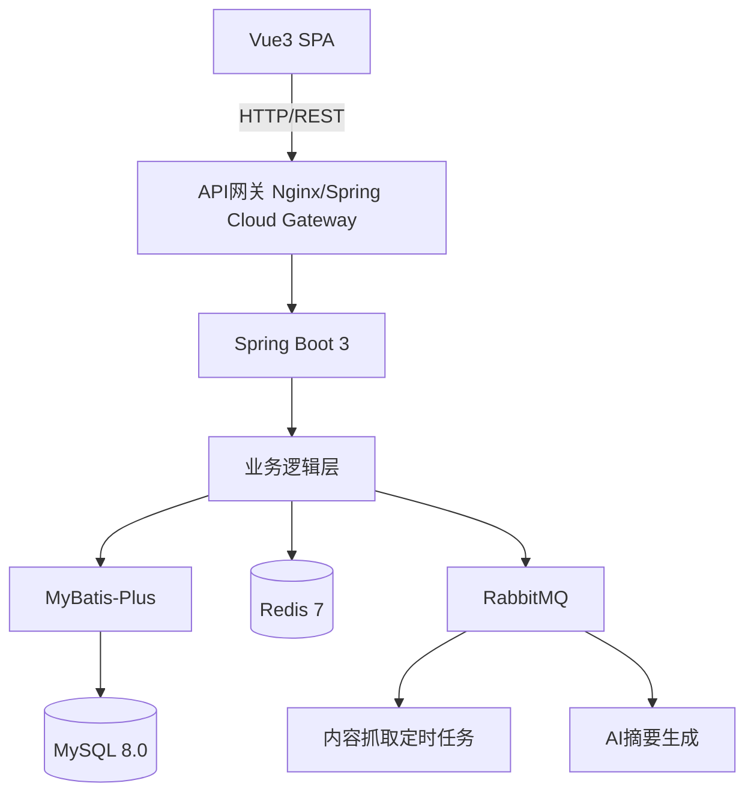

好的，我帮你整理一份面向AI接手、高度结构化的项目文档。它包括了**项目定义、技术栈、架构、数据模型、业务版图、开发计划、里程碑和当前状态**，确保任何AI模型都能无缝接手后续工作。

---

```markdown
# DemoNet 1.0 项目文档

> **目标**：将早期静态内容展示站升级为全栈、多品类“体验前置”平台，解决玩家/影迷/爱好者在付费前的决策痛点。
> **当前状态**：开发环境已就绪，项目文件夹为空，准备开始编码。

## 1. 项目定位与核心价值

**一句话定位**：一个策展化的“试玩派对”——聚合游戏 Demo、电影预告片、桌游教学、模型开箱等一切能让你“先试试”的内容，帮助用户用碎片时间高效决策。

**目标用户**：
- 喜欢尝鲜的玩家、影迷、动漫迷、桌游/模型爱好者
- 独立开发者（希望自己的Demo被看见）

**核心价值**：
- 最快发现下一个值得投入的作品
- 用15分钟试玩/预告片代替2小时踩雷

---

## 2. 业务版图（完整品类）

DemoNet 不限于数字娱乐，只要是购买前需要“体验前置”的品类均可纳入。

| 业务线 | Demo 形态 | 示例 |
|--------|-----------|------|
| 电子游戏 | 免费试玩版下载 / 浏览器可玩 iframe | Steam Next Fest, itch.io |
| 电影 | 官方预告片 / 导演访谈 | TMDB + YouTube |
| 动漫 / 剧集 | 先导预告 / 前5分钟试看 / PV | AniList, B站 |
| 桌游 | 规则教学视频 + 在线模组（Tabletopia） + 实况回放 | BGG, UP主合作 |
| 模型 / 手办 | 板件/素组图、360°展示、涂装范例、比例对比 | 拼装模型、雕像、乐高 |
| 书籍 / 漫画 | 前20页试读、有声书样音 | 出版社合作, Webtoon |
| 音乐 / 乐器 | 30秒高潮试听、音色对比 | Spotify, 测评音频 |
| 咖啡 / 茶 | 风味轮盘、冲泡指南、小样包入口 | 虚拟杯测 |
| 数码产品 | 打字音试听、频响曲线、AR试戴 | 机械键盘、耳机、手表 |
| 线下体验 | 密室剧情试读、展览预览、手作工坊视频 | 店家合作, UGC |

---

## 3. 技术选型与架构

### 3.1 总体架构（分离式）



### 3.2 详细技术栈

| 层级 | 技术 | 版本/说明 |
|------|------|-----------|
| **前端** | Vue 3 + Vite | Composition API + `<script setup>` |
| | Pinia | 状态管理 |
| | Vue Router 4 | 动态路由 `/game/:slug` |
| | Element Plus | UI组件库（后台/管理） |
| | Tailwind CSS | 个性化布局（用户端） |
| | Axios | HTTP请求，拦截器处理JWT |
| **后端** | Spring Boot | 4.0.6, JDK 17 |
| | MyBatis-Plus | 3.5.x, 强大条件构造器 |
| | Spring Security + JWT | 无状态认证，支持OAuth2扩展 |
| | SpringDoc (OpenAPI 3) | 自动生成Swagger文档 |
| **中间件** | MySQL | 8.0, 主数据库 |
| | Redis | 7.x, 缓存/计数器/Session |
| | RabbitMQ | 3.12, 异步任务（抓取、AI、索引） |
| **部署** | Docker Compose | 本地 & 生产环境统一 |
| | Nginx | 反向代理 + 静态资源 |
| **工具** | Maven | 3.9+，多模块管理 |
| | Git & GitHub | 版本控制，仓库名 `DemoNet-3.0` |

---

## 4. 数据模型（核心表）

### 4.1 统一内容表 `items`

```sql
CREATE TABLE items (
    id BIGINT AUTO_INCREMENT PRIMARY KEY,
    type VARCHAR(20) NOT NULL COMMENT 'game, movie, anime, boardgame, model, ...',
    title VARCHAR(255) NOT NULL,
    slug VARCHAR(255) NOT NULL UNIQUE,
    cover_url VARCHAR(512),
    wide_cover_url VARCHAR(512),
    description TEXT,
    info_json JSON COMMENT '弹性属性，如游戏配置、导演、桌游人数字段',
    external_id VARCHAR(100) COMMENT 'Steam AppID, TMDB ID',
    source VARCHAR(30) DEFAULT 'manual' COMMENT 'manual, steam, tmdb, itch',
    status TINYINT DEFAULT 1 COMMENT '1-上线 0-下架',
    created_at DATETIME DEFAULT CURRENT_TIMESTAMP,
    updated_at DATETIME DEFAULT CURRENT_TIMESTAMP ON UPDATE CURRENT_TIMESTAMP,
    INDEX idx_type (type),
    INDEX idx_slug (slug)
);
```

### 4.2 用户相关表

```sql
CREATE TABLE users (
    id BIGINT AUTO_INCREMENT PRIMARY KEY,
    username VARCHAR(50) NOT NULL UNIQUE,
    email VARCHAR(100) NOT NULL UNIQUE,
    password_hash VARCHAR(255) NOT NULL,
    avatar VARCHAR(255),
    created_at DATETIME DEFAULT CURRENT_TIMESTAMP
);

CREATE TABLE user_items (
    id BIGINT AUTO_INCREMENT PRIMARY KEY,
    user_id BIGINT NOT NULL,
    item_id BIGINT NOT NULL,
    status VARCHAR(20) COMMENT 'want_to_play, played, loved, dropped',
    played_duration INT COMMENT '秒',
    note TEXT,
    created_at DATETIME DEFAULT CURRENT_TIMESTAMP,
    FOREIGN KEY (user_id) REFERENCES users(id),
    FOREIGN KEY (item_id) REFERENCES items(id)
);
```

### 4.3 其他扩展表

```sql
CREATE TABLE tags (
    id BIGINT AUTO_INCREMENT PRIMARY KEY,
    name VARCHAR(50) NOT NULL UNIQUE
);

CREATE TABLE item_tag_mapping (
    item_id BIGINT NOT NULL,
    tag_id BIGINT NOT NULL,
    PRIMARY KEY (item_id, tag_id)
);

CREATE TABLE reviews (
    id BIGINT AUTO_INCREMENT PRIMARY KEY,
    user_id BIGINT NOT NULL,
    item_id BIGINT NOT NULL,
    rating TINYINT,
    comment TEXT,
    created_at DATETIME DEFAULT CURRENT_TIMESTAMP
);
```

---

## 5. 开发计划与里程碑

### 阶段 0：项目骨架 + 通路闭环（第1天）
- [x] 开发环境搭建（JDK17, Node20, Docker, VSCode/IDEA）
- [x] Docker 中间件启动（MySQL, Redis, RabbitMQ）
- [ ] 前端初始化：Vite + Vue3 + 基础依赖
- [ ] 后端初始化：Spring Boot 多模块（Maven）
- [ ] 数据库建表
- [ ] 实现 `GET /api/items` 返回测试数据
- [ ] 前端调用接口展示数据
- **产出**：数据从后端到前端的通路跑通

### 阶段 1：核心内容浏览（第2-4天）
- [ ] 完成 `items` 表 CRUD API（分页、筛选、按slug查询）
- [ ] 手动导入原有 19 条数据（games.json, movies.json 等）
- [ ] 前端路由：首页、列表页、详情页（动态渲染）
- [ ] 实现轮播、卡片布局（参考旧版特效）
- **产出**：可浏览 19 条内容的动态网站

### 阶段 2：用户系统（第5-6天）
- [ ] 实现注册/登录 API（JWT）
- [ ] 前端登录注册页面，Pinia 存储 token
- [ ] 收藏/标记状态功能（`POST /api/user/items`）
- [ ] 个人中心页面（我的试玩清单）
- **产出**：用户可注册、登录、收藏

### 阶段 3：搜索与推荐（第7-8天）
- [ ] 搜索 API（模糊查询）
- [ ] 标签系统，标签筛选
- [ ] 简单推荐：“同类型热门”、“最近收藏最多”
- **产出**：内容可被发现，有一定个性化

### 阶段 4：内容自动化管道（第9-12天）
- [ ] 编写 Steam API / TMDB API 抓取脚本
- [ ] RabbitMQ 异步任务处理
- [ ] 简单管理后台（审核抓取内容，一键上线）
- **产出**：内容自动更新，无需手动编 JSON

### 阶段 5：多业务线扩展（第13-15天）
- [ ] 新增 `type` 枚举值（boardgame, model）
- [ ] 手动导入10款桌游、10款模型数据
- [ ] 前端详情页根据 `type` 渲染不同模板（桌游显示人数时长，模型显示比例材质）
- **产出**：平台支持多品类，可扩展

### 阶段 6：部署上线（第16-17天）
- [ ] 编写 Dockerfile，后端打包镜像
- [ ] 前端 build，Nginx 托管
- [ ] 云服务器部署（阿里云/腾讯云 2C4G）
- [ ] 配置域名 + HTTPS
- **产出**：公网可访问

---

## 6. 当前环境现状

- **开发设备**：macOS 12, MacBook Pro
- **JDK**：17 (已配置)
- **Node.js**：20 (已配置)
- **IDE**：IntelliJ IDEA 社区版（已更新至2025.3+）或 VSCode
- **中间件**：Docker 运行中，MySQL(3306), Redis(6379), RabbitMQ(5672/15672) 可用
- **项目目录**：`DemoNet-3.0/`，内含两个空文件夹 `frontend/`, `backend/`

---

## 7. AI 接手操作指南

1. **初始化前端**：在 `frontend/` 执行 `npm create vite@latest . -- --template vue`
2. **初始化后端**：
   - 打开 IDEA（或使用 Spring Initializr 命令/VSCode 扩展）
   - 创建 Maven 项目，勾选 Web, MyBatis, MySQL, Security, AMQP 依赖
   - 生成后放置于 `backend/` 目录
3. **配置数据库**：在 `application.yml` 中填入 MySQL/Redis/RabbitMQ 连接信息
4. **建表**：执行上述 SQL 语句，创建核心表
5. **编写第一个接口**：`GET /api/items` 返回硬编码列表，验证前后端连通性
6. **按阶段逐步推进**，参考上述里程碑

---

## 8. 核心注意事项

- **所有资源图片路径**统一存数据库中，不再用文件目录结构
- **内容来源合法**：仅聚合公开 API 和官方渠道，不做盗版文件存储
- **弹性字段**：`info_json` 使用 JSON 类型，新增品类无需改表
- **异步处理**：耗时任务（抓取、AI 摘要）必须走 MQ，避免阻塞用户请求
- **前端跨域**：开发时配置 Vite 代理，生产用 Nginx 反代

---
